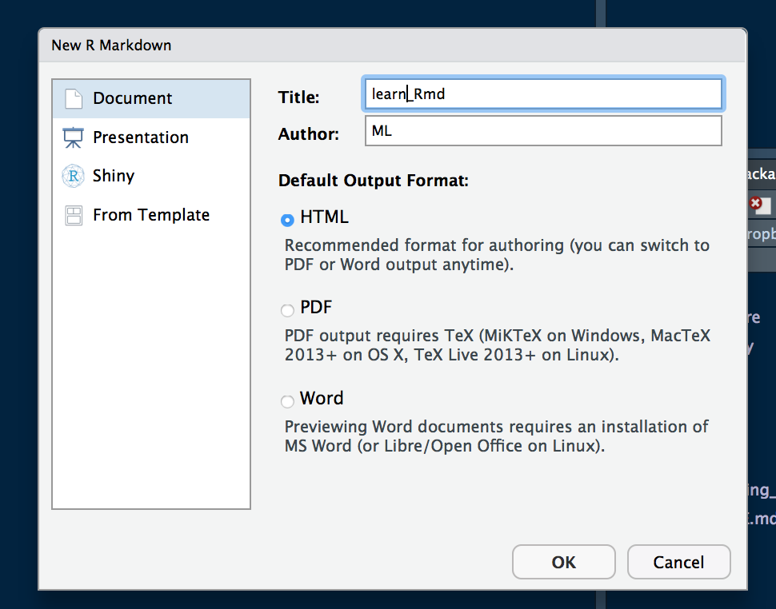
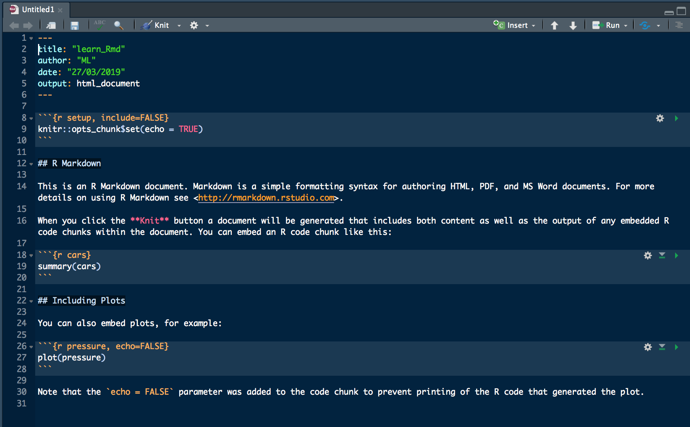

```{r mysetup, include=FALSE}
knitr::opts_chunk$set(error = TRUE) #allow some execution errors for demonstration purposes
knitr::opts_chunk$set(eval = TRUE, echo = TRUE, warning = FALSE, collapse = TRUE, comment = "#>")
sessionInfo()

```

**Before the lesson:**    
Please make sure you got the latest RStudio and latest R version installed.

**Lesson objectives:**   
 * learn and practice basic markdown notations   
 * making simple R markdown (Rmarkdown) documents in RStudio   

**Lesson outline:**   
 * About this lesson   
 * Markdown   
 * Rmarkdown   
 * Why we need Rmarkdown?   
 * Why RStudio?   
 * Starting RStudio  
 * Creating new Rmarkdown (Rmd) document file   
 * Knitting Rmd document   
 * Changing Rmd document     
 * Code chunks   
 * Changing code chunks   
 * In-line R code   
 * Displaying graphics   
 * More resources    

# About this lesson

This lesson is prepared for these who are already familiar with R coding language, but have not used R markdown (Rmarkdown) or RStudio. Thus, we assume basic knowledge of R programming language and we aim to teach the only the basics of Rmarkdown and RStudio. By the end of this tutorial you should be able to create a simple html document containing  markdown-formatted text, images and R code, all in RStudio.

By the way, this document was created using Rmarkdown in RStudio!

****

# Markdown
Markdown is a simple text formatting syntax for crating HTML documents (at least originally). It works by introducing special sets of formatting characters directly into the texts, which are understood by the text viewers and rendered as formatted text.   

### TASK 1    
Take a short online tutorial to learn the basics of the standard markdown (15-30min):
https://commonmark.org/help/tutorial/

### TASK 2    
Have a look at the markdown reference page:
https://commonmark.org/help/


****
# R Markdown 
R Markdown (Rmarkdown) is a version of Pandoc’s markdown formatting, which is in turn based on the standard Markdown you just learned above. There are small differences between different versions of Markdown (just like English!), but the basic formatting conventions should work for most of the markdown styles. Pandoc's markdown (and Rmarkdown)  has additional syntax available for formatting tables, footnotes, maths and other non-basic text features that are useful when preparing documents in R. The complete list of Markdown formatting futures available via Pandoc, please visit the official documentation <https://pandoc.org/MANUAL.html#pandocs-markdown> (actually, Pandoc is a universal converter for many markup formats, but we are not going to cover it here).    


### TASK 3    
Have a look at the Rmarkdown cheat sheet (save the pdf for future reference!):    
<https://www.rstudio.com/wp-content/uploads/2016/03/rmarkdown-cheatsheet-2.0.pdf>    


****
# Why Rmarkdown?    

### TASK 4    
Using information from the cheat sheet, try to find at least 3 reasons for using Rmarkdown cheat sheet.    

****
In brief, rather than having your R code in one document and the text describing it in another, Rmarkdown documents allow combining these two (and other outputs, like tables and plots) in a single file.    

Apart of this, there are several main advantages of working with Rmarkdown documents:    
 - as in plain R file, you can save and execute code    
 - you can split your code into smaller units called "chunks", which are tidier and easier to work with   
 - the Rmarkdown document gets translated ("knitted") into an output document, and you have control on how it is formatted and what is included: elements such as Rcode, R text output, plots, tables, pictures, can be turned on or off        
 - you can use Rcode in-line inserts to dynamically update values presented in your text (i.e. no more coping and pasting results of statistical tests!)    
 - once you know Rmarkdawn you can use it and its extensions to create a wide range of documents, including presentations, websites, and even books    
 - finally, you can generate high quality and reproducible reports in various formats    

### TASK 5    
Have a look at this 1-minute video about what’s possible with Rmarkdown:    
<https://rmarkdown.rstudio.com/lesson-1.html>   
Note: this webpage contains more detailed and extensive lessons on using Rmarkdown in RStudio - you should have a look at these later on.   


****

# Why RStudio?    

RStudio is a well-established and well-supported GUI (Graphical User Interface) that makes working with R code and Rmarkdown easier (and it is free and Open-Source as well). It does not take away the fun of typing and editing code in an "code editor" window and/or an R console!
But, it also has menus and additional windows that display useful things, such as help info, your plots, lists of files, packages and objects stored in your computing environment, simplified Git interface, etc. These extras make coding and creating documents in RStudio much easier to learn and often more efficient. Especially, RStudio makes creating Rmarkdown documents easy. Let's have a go at it.   

### TASK 6      
Have a quick look at the range of outputs that can be created using Rmarkdown:   
<https://rmarkdown.rstudio.com/gallery.html>   


****

# Starting RStudio   

## RStudio window   
You should have RStudio installed by now. Open it on your computer. You will see four standard panes and some tabs within panes (you can resize or close them once you know what settings work for you best, for now leave as they are).   

****

# Creating new Rmarkdown (Rmd) document   

### TASK 7      
From the top menu go to "File" -> "New File" -> from drop-down list select "R markdown..."     
A new window will pop up asking you for a Title and an Author (enter something suitable):   

```{r New_R_markdown_popup, echo=FALSE, fig.cap=" ", out.width='50%'}

```

Keep the output format as .html for now, as the other 2 formats (pdf and Word document) may require additional installations of packages. Press "OK".   
A new document (file) tab will open in the main "Editor" window:   

```{r New_R_markdown_file, echo=FALSE, fig.cap=" ", out.width='100%'}

```

Note that the file is pre-filled with some example content and basic instructions on using Rmarkdown in RStudio.    

****

# Knitting Rmd document 

### TASK 8      
Find the "Knit"" button on top of the code editor window and press it (or use keyboard shortcut Command+Shift+K (MAC) / Ctrl+Shift+S (Windows), there is also an option in the top menu).
A new pop-up will open asking you to save the file first, so enter suitable name and save the file (the keyboard shortcut to save changes in the file later is Command+S (MAC) / Ctrl+S (Windows), there is also a floppy disc button on top of the window ).   

The bottom window will switch from the "Console"" tab to the "R markdown" tab, and some processing code will appear there (useful when knitting does not work - check error messages in this window). A "knitted" html document should appear in a new pop up window (this file can be also seen in the internet browser - use a button on the top of the window).    

This knitted example html document has the text that is formatted, some R code, some R code output and an embedded plot. The name of the file is the same as the markdown document you just saved and named, but has **.html** as its file name extension (Rmarkdown documents have file extension - **.Rmd**). The file be default gets saved in the same folder as your source (Rmarkdown) file.    

****

# Changing code chunks   

Code chunks contain one or more lines of R code.    
To distinguish R code from the plain text. each chunk is surrounded with three ACCENT GRAVE (`) characters (three at the start and three at the end..
Each chunk, after initial " ``` ", has a code chunk header surrounded with curly braces {}. The header starts with the symbol "r", followed by chunk name/label and (optional) chunk options, e.g. {r pressure, echo=FALSE}.   

### TASK 9     
In RStudio code editor window, go to the code chunk named "cars" (that is the second code chunk in the example file).  
Add a following line at the end of the chunk:   

```{r, eval=FALSE}
head(cars)
```

Note that a symbol * appeared next to file name in the tab - it indicates that the file contains unsaved changes.   

Save the changes, knit the document and see the new output file.    

The code should look like this:   
```{r cars}
summary(cars)
head(cars)
```
An additional output (top few rows of the data set) should appear after the new line of code (note that different shades of grey background are used - this is a standard way of indicating the code and output in knitted documents).    

### TASK 10     
Back in RStudio code editor window, go to the "cars" code chunk and change the chunk header from {r cars} to {cars, echo=FALSE}.    
Save and knit the file.    
What happened?    

The R code of the first chunk of code should be hidden now. parameter "echo" determines whether the code itself should be shown or not.  

### TASK 11      
Back in RStudio code editor window, go to the "cars" code chunk and change the chunk header from {r cars, echo=FALSE} to {cars, echo=TRUE}.    
Save and knit the file.    
What happened?   

The R code of the first chunk should be visible again.    

Similarly to changing the visibility of the R code, you can turn on and off the output of the code (the stuff that is displayed in the R "console" window after each line of executed code) by using parameter "include" (TRUE or FALSE).    
You can also set whether each individual chunk of code actually gets executed, by using parameter "eval" (TRUE or FALSE). This allows you to switch off the chunks that are not needed anymore for some reason.      

These were the most commonly used parameters of individual chunks and we will practice using them in a few of the tasks below. However, you also need to know can also set these parameters globally - i.e. for the whole Rmarkdown document - by using a special "setup" code chunk at the start of the document, with a "opts_chunk" function. Have a look at the top of your RMarkdown document - you should see this first chunk with the document settings:

```{r setup, include=FALSE}
knitr::opts_chunk$set(echo = TRUE)
```

This code sets up all the chunks to a default of displaying R code. It basically says: "unless otherwise specified inside the chunk, for all chunks assume echo=TRUE (i.e. display R code from each chunk by default)".    

### TASK 12      
Back in RStudio, in the code editor window, go to the first code chunk and change the chunk header from {r cars, echo=TRUE} to {cars, eval=FALSE}.    
Save and knit the file.   
What happened?   

Now, the code should be still visible, but the output should disappear. As mentioned earlier, "eval=FALSE" turns off evaluation of the R code within the chunk (i.e. it is not executed), so there is no output (default RStudio setting is to evaluate all R code).

****
## In-line R code   

### TASK 13      
Back in RStudio code editor window, under the "cars"" code chunk (i.e. in the text section) write (without the quotes: 
"
The mean car speed is `r mean(cars$speed)` mph.
"
Save and knit the file.    
What happened?    

Now you should have a line of text with in-line value representing mean spread of the cars from the example "cars" data set.   If the data frame changes in any way and you re-knit the document, this value will be updated automatically.    

****
## Displaying graphics     

### TASK 14      
Back in RStudio code editor window, go to the "pressure"" code chunk and change the chunk header from {r pressure, echo=FALSE} to {r pressure, include=FALSE}    
Save and knit the file.   
What happened and why?   

Now, the graph is gone from the knitted file.   
The code gets executed, but we the output (the plot) is not included in the knitted document.    

### TASK 15     
We now try to save the plot as a jpeg file. Change the header in the "pressure" code chunk to eval=TRUE, and the code inside the "pressure" code chunk to:

```{r pressure, echo=TRUE, eval=FALSE}
jpeg(file = "pressure.jpeg")
plot(pressure)
dev.off()
```
Save and knit the file.    
What happened?    

The code returns a message (you can get rid of it by changing echo=FALSE to include=FALSE), but the plot does not appear in the .html document. It is because the plot gets saved as a new jpg file into your working directory. We will get it out of there in the next task!      

### TASK 16      
Now we will use the saved picture from the previous task to practice embedding picture files saved on the computer into an Rmarkdown document. Add some text below the last code chunk, e.g.:    
"...and now let's add the figure from a saved file:"    

Then, create a new code chunk (you can type all the chunk symbols manually, use Insert - R button at the top of the editor window, function from the main menu or command+alt+I shortcut). Remember to give it a header with a new (unique!) name, e.g.:   

{r pressure plot from a file}       

The contents of the chunk:    
```
knitr::include_graphics("pressure.jpeg")    
```

This should work for a file saved in your current working directory. 
For files located elsewhere you will need to use full or partial path to point the code to the location of the file (its good to have all images in a dedicated sub-directory of your working directory, named e.g. "images").   

Finally, you do not need to re-knit the whole document each time.
You can run still run individual (or groups of) lines of code by highlighting them and pressing command+enter as in a basic R editor. You can run individual chunks using several options (and keyboard shortcuts) listed under the Run button at the top-right of the code editor window (check it out now!). This gives you more flexibility and makes it faster to work with you R code. And that was one of the reasons for this tutorial.     

But that's not all, there are many more secrets to productive work with RStudio.   
So, if you have some time, read about using projects in RStudio:   
https://support.rstudio.com/hc/en-us/articles/200526207-Using-Projects   
and this...  
https://www.tidyverse.org/articles/2017/12/workflow-vs-script/   
and start using it!   

*****

*We hope this lesson got you started on the path to beautiful and reproducible documents in Rmarkdown using RStudio...    *


*****
# More resouces   

**R Markdown:**      
- more details on using R Markdown: <http://rmarkdown.rstudio.com>   
- alternative Rmarkdown reference file:  <https://www.rstudio.com/wp-content/uploads/2015/03/rmarkdown-reference.pdf>   

**RStudio:**      
- keyboard shortcuts to speed you up in RStudio: <https://appsilon.com/r-studio-shortcuts-and-tips/>   
- book "Getting started with RStudio": <https://www.cs.utexas.edu/~cannata/dataVis/Class%20Notes/Getting%20Started%20with%20RStudio.pdf>   
