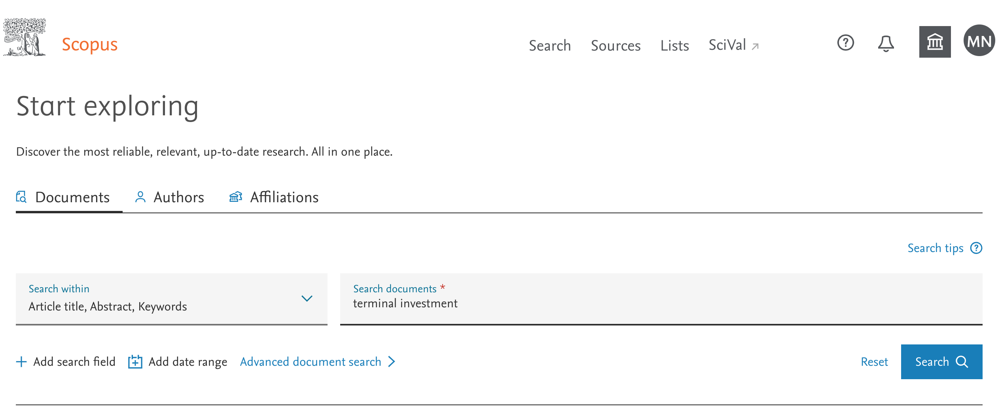
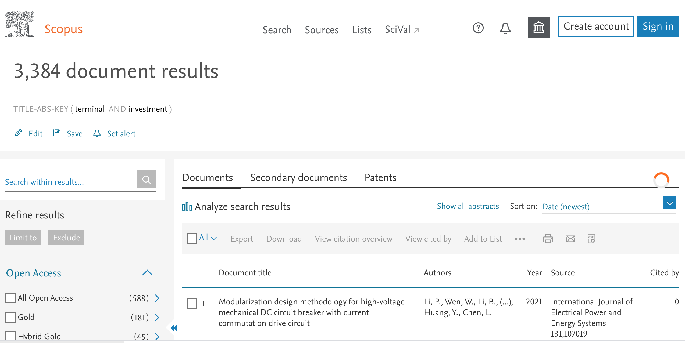
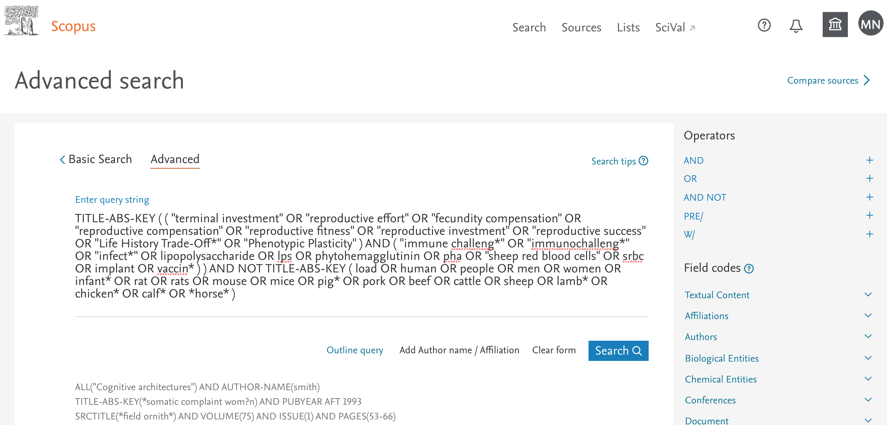
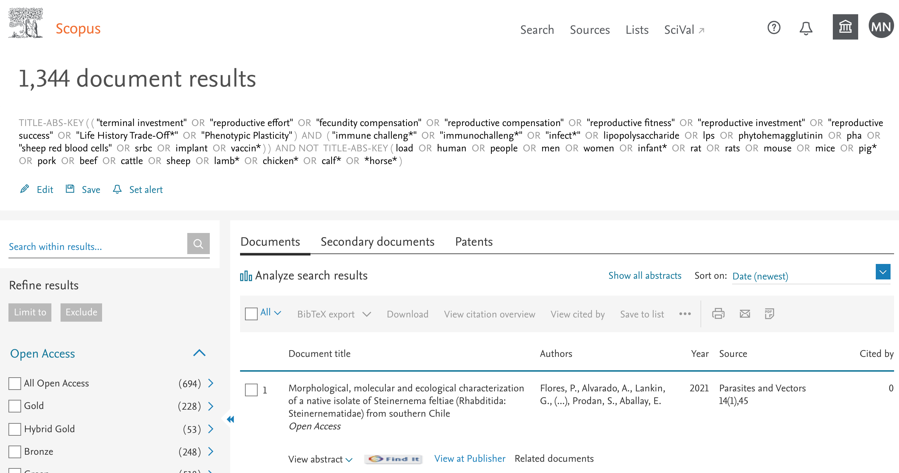
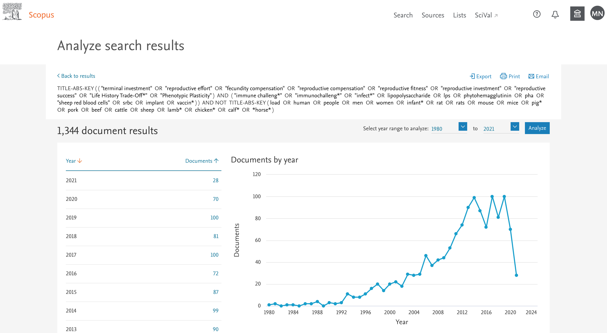
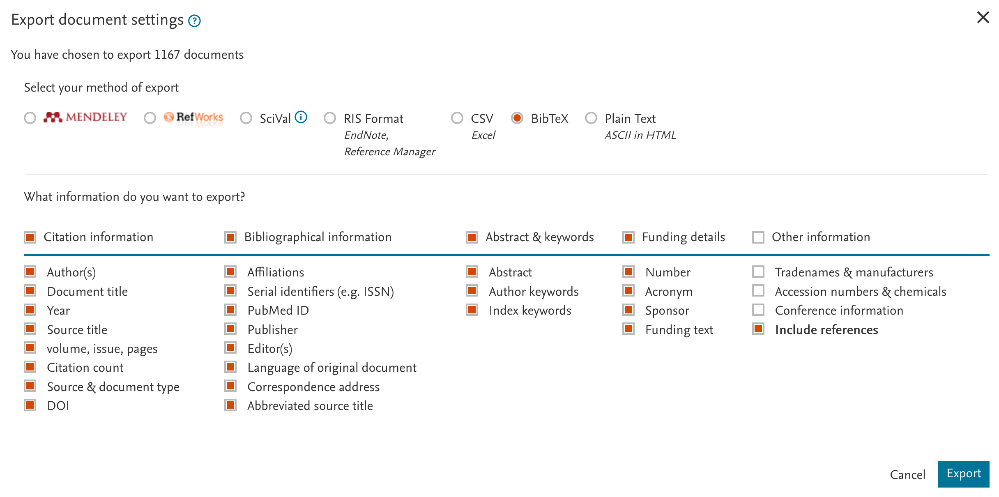

```{r mysetup, include=FALSE}
knitr::opts_chunk$set(error = TRUE) #allow some execution errors for demonstration purposes
knitr::opts_chunk$set(eval = TRUE, echo = TRUE, warning = FALSE, collapse = TRUE, comment = "#>")
sessionInfo()
library(bibliometrix)	
```

**Before the lesson:**    
Please make sure you got the latest RStudio and latest R version installed.   

**Lesson objectives:**   
 * Learn to perform a search in academic literature database   
 * Download search results and import them into R    
 * Summarise bibliometric data   
 * Make a few types of simple bibliometric networks   
 * Plot bibliometric networks    
 
**Lesson outline:**   
 * About this lesson   
 * Getting bibliometric data   
 * Summarising bibliometric data   
 * Creating bibliometric networks   
 * More resources     
 
 
**** 

## About this lesson   

This lesson is prepared for these who are already familiar with R coding language, R markdown and RStudio.
By the end of this tutorial you should be able to create a simple html document containing  markdown-formatted text, images and R code - all in RStudio.   


****

## Getting bibliometric data

You can do analyses of literature on any topic.   

In this lesson we will have a look at the academic literature related to the concept of Terminal Investment.  

Terminal Investment hypothesis predicts increased investment of resources into reproduction as the chances of survival decrease. This can be observed as increased reproductive effort in older animals or in animals challenged with factors signalling threat to their survival (e.g., predation, pathogenes, parasites).    

Terminal investment in animals is usually studied in three main ways:     
 1. via observational studies of correlations of age and reproductive effort,      
 2. in experimental studies where animals are subject to immune challenges and their subsequent reproductive effort is compared to unchallenged animals of the same age,    
 3. in experimental studies where reproductive response to immune challenge is compared between animals of older ages versus younger ages.   

You can read more on this Wiki page: https://en.wikipedia.org/wiki/Terminal_investment_hypothesis   

We hope the topic is quite appealing and quiet easy to understand.There are several published reviews on terminal investment hypothesis and we can expect many publications related to this topic, as well as many researchers working on it. Is this so?  

Today, we will try to run bibliometric analyses on the relevant sample of literature. Note that there are a few available  R packages (and many other online/software tools, and new are being developed) that can perform some of the tasks which we will practice during this exercise, and often they can do much more. For your own project you may want to try to use some other tools, but there is no single "perfect" tool that fits all possible analyses and that is easy and usable for all disciplines and types of research questions. Also note that the main purpose of this exercise is to familiarize you with the basic principles/issues of bibliometric analyses. You can always learn more in your own time if you are interested.       


****

*The search*

First, we need to find a representative sample of academic publications on our topic of choice. For this, we will use cross-disciplinary database of academic literature, Scopus. This database has the largest coverage of the published literature and should give us the most complete picture. An alternative database, commonly used for broad academic literature searches and analyses, is Web of Science: https://www.webofknowledge.com/ (WoS; it has slightly different way of formatting search strings).   

You should have free access to Scopus and WoS database on campus, but you may not be able to access it from outside the campus unless you use UNSW VPN or other university proxy servers (try loging in via the Library). Free-access broad-coverage databases include BASE (Bielfield Academic Search Engine, https://www.base-search.net/)  and Lens (https://www.lens.org). Google Scholar (https://scholar.google.com/) is not recommended for this type of work, mainly because it is hard to export bibliometric records from the results list.    


****   

### TASK 1    
Go to Scopus search page: https://www.scopus.com/search/form.uri?display=basic and enter the phrase "terminal investment" (without quotation marks) in the basic search window, as follows:   

```{r Scopus_TI_res_simple_search, echo=FALSE, fig.cap=" ", out.width='80%'}

```


****   

Press "Search"" button.    
You should see results like this (note theat your numbers will be a bit higher due to accumulation of new literature since this tutorial was written):   


****   

```{r Scopus_TI_res_simple_search_res, echo=FALSE, fig.cap=" ", out.width='80%'}

```


****   

Hey, this does not look good... - many documents were found, and most of them are completely unrelated (e.g. on building shipping terminals).   
Why is that?    


****   

This is because our search is too simple. It allows us only to find the papers that explicitly mention terminal AND investment words in their title, abstract or keywords (the AND operator is a default one and it gets inserted automatically by the search software). To find a more relevant set of bibliometric records for our analyses, we need a more sophisticated search string.   

Additionally, we will narrow down our topic a little bit more and aim to find papers that use immune challenge approach in wild or semi-wild animal species (so, we try to exclude established lab model species such as mice and rats, domesticated animals such as dogs and pigs, and humans). Finding the best search string is a bit of an art, so we just provide you with this one to save time:   

```
TITLE-ABS-KEY ( ( "terminal investment"  OR  "reproductive effort"  OR  "fecundity compensation"  OR  "reproductive compensation"  OR  "reproductive fitness"  OR  "reproductive investment"  OR  "reproductive success"  OR  "Life History Trade-Off*"  OR  "Phenotypic Plasticity" )  AND  ( "immune challeng*"  OR  "immunochalleng*"  OR  "infect*"  OR  lipopolysaccharide  OR  lps  OR  phytohemagglutinin  OR  pha  OR  "sheep red blood cells"  OR  srbc  OR  implant  OR  vaccin* ) )  AND NOT  TITLE-ABS-KEY ( load  OR  human  OR  people  OR  men  OR  women  OR  infant*  OR  rat  OR  rats  OR  mouse  OR  mice  OR  pig*  OR  pork  OR  beef  OR  cattle  OR  sheep  OR  lamb*  OR  chicken*  OR  calf*  OR  *horse* )  
```


****   

### TASK 2    
You need to copy and paste the above search string into the Advanced Search tab of the Scopus Search page:

```{r Scopus_TI_res_all_adv_search.png, echo=FALSE, fig.cap=" ", out.width='80%'}

```

****   

Press "Search"" button. You should see results like this:   


****   

```{r Scopus_TI_res_all.png, echo=FALSE, fig.cap=" ", out.width='80%'}

```


****   

There are still over 1,300 records retrieved from the Scopus database. Some look relevant and many are not, but that is always the case, for a systematic review or a meta-analysis we would manually screen all an exclude all irrelevant papers).    

On the left side of the results window you can see simple filters: year, most common author names, subject areas, etc. You can explore the whole set roughly by using "Analyze search results" link above the table of the hits:   

```{r New_R_markdown_popup, echo=FALSE, fig.cap=" ", out.width='80%'}

```

There are more graphs below, and you can expand and customise them a bit too - have a look!   


****   

### TASK 3    

Next, we can export the bibliometric records for more detailed bibliometric analyses in R. To do so, close the Scopus analyses window and go back to the list of the records found. First, select all records by clicking box "All" in the left top of the list of references. Then click the "Export" link to the right.    

A pop-up window with the export options will appear.   

First, select the format of the export: we will uses .bib file (BibTex format of references, one of the standard ones).   
Second, select which fields have to be exported by clicking the boxes on top of each column (or as needed).   
For bibliometric analyses on the citations among papers, it is essential to tick the box next to "Include references" (i.e. data on the cited documents).   

Note that, unfortunately, Scopus limits number of exported records to 2,000. For longer lists of records, you will need to split them in smaller chunks for the export and then merge into a single larger data set (not covered in this tutorial; WoS export limits are 1,000 records).    

```{r Scopus_TI_res_all_export_bib, echo=FALSE, fig.cap=" ", out.width='80%'}

```


****   

Click "Export" button. A file named "Scopus" (with extension matching your export type file, e.g., bib) will be saved to your downloads folder.    
Note that when you export references with their reference lists included in the records, the resulting files are quite large (in our case around 16Mb).   

In case you did not succeed exporting the files (or wish to work with exactly the same ones we used, or you cannot access Scopus), the files downloaded on 27/05/2019 are provided (note tha a standard way is to store them inside a "/data" sub-directory).   


****   

### TASK 4    

Create a new Rmarkdown file to save your code (you can do this within new RStudio project).
Install and upload *bibliometrix* R package:


```{r upload packages, eval=FALSE}
install.packages("bibliometrix", dependencies=TRUE) ### installs bibliometrix package and dependencies
library(bibliometrix)	#uploads the package
# Note: output not displayed for this chunk
```

Upload the file exported from Scopus (you can use the one provided) into RStudio (note that the file path you may need to use on your computer may be different, e.g., "H:/Users/z1234567/Downloads/scopus.bib").    
Then, convert the data from that file into internal *bibliometrix* format.  

```{r upload data, eval=TRUE}
bib <- convert2df("data/scopus.bib", dbsource = "scopus", format = "bibtex") # Convert to a bibliometric data frame
names(bib)
#write.csv(bib, "data/bib_as_df.csv", row.names = FALSE) #if you want to save this data frame as a csv file
```

After some processing, an object called "bib" is created. It contains a data frame with each row corresponding to one exported publication from Scopus and with each column corresponding to a field exported from Scopus online database. If you tried to achieve this by exporting a csv file directly from Scopus, you would sometimes get a messy data frame, due to missing field values shifting the cells between columns. 


****   

### TASK 5    
What are the contents of the columns of our "bib" data frame?  Columns are labelled with a two-letter tags: `r names(bib)`.    
For a complete list and descriptions of field tags used in *bibliometrix* you can have a look at this file:   http://www.bibliometrix.org/documents/Field_Tags_bibliometrix.pdf   
Our data frame contains just a subset of these codes. Which ones?   
 
Note that column **bib$AU** contains authors of each paper (as surnames and initials) separated by semicolon (;). We can easily split these strings and extract a list of all author names to a vector:    

```{r get author names, eval=TRUE}
# head(bib$AU) #have a look at the few few records on your screen
authors <- bib$AU
authors <- unlist(strsplit(authors, ";")) #split the records into individual authors
authors <- authors[order(authors)] #order alphabetically
head(authors) #have a look again
# View(unique(authors)) #use to see all the values
# write.csv(authors, "data/author_list_uncleaned.csv", row.names = FALSE) #if you want to save this data frame as a csv file
```


****   

### TASK 6    
Cited references for each included paper are in the CR column of the "bib" data frame. They are in a single string, also separated by semicolon (;). We can have a look at them and check whether familiar names were cited, e.g.:   

```{r  citations, eval=TRUE}
dim(bib) #dimensions of the data frame
names(bib) #names of the columns of the data frame
#bib$CR[1] #display a list of cited references for the first paper in the data frame 
#(we are not displaying it in this document as it is a very long string! - examine it on your screen instead)
#look whether some of these names are cited:
grep("NAKAGAWA, S.", bib$CR) 
grep("CORNWELL, W.", bib$CR) 
bib[grep("CORNWELL, W.", bib$CR), c(1:3)] #who is citing?
```


****   

## Summarising bibliometric data

### TASK 7    

Luckily, *bibliometrix* package  has a handy function that summarises the information contained in the "bib" data frame, so we can get some quick facts about our set of papers.   

**Note:** this and the following tasks require quite a bit of computational power, they may be slow or even halt on your computer.    
In such case, for this exercise, make your data frame smaller by sub-setting it, e.g.:   
"bib <- bib[1:500, ] #taking first 500 records". However, the results and plots you will produce with a sub-setted data frame will differ from the ones presented in this document.     

```{r  descriptive tables, eval=TRUE}
# Preliminary descriptive analyses 
results <- biblioAnalysis(bib, sep = ";")
#summary(object = results, k = 10, pause = TRUE) #display a series of summary tables

# Reduce the data set to the subset first 500 records
bib <- bib[1:500, ] #taking first 500 records
#summary(object = results, k = 10, pause = TRUE) #display a series of summary tables
```

Using *summary* function on *bibliometrix* results, you  get several screens with various tables summarising bibliometric data from our data frame - how many documents, journals, keywords, authors, publications time-span, collaboration index, annual publication growth rate, most prolific authors, publications per country, per journal, per keywords, etc.    

You can automatically plot some of these tables (hit "return"" to display next graph, and later you can use arrows in the top left of the plots pane to move back and forth between consecutive plots saved in the RStudio memory):  

```{r  descriptive plots, eval=TRUE, message=FALSE}
plot(results, k = 10, pause=TRUE) #this takes top 10 values from each plottable table

#the code below is for saving these plots into a pdf:
# pdf(file = "plots/bib_descriptive_plots.pdf", height = 8, width = 8, pointsize=10) #
# plot(results, k = 20, pause=FALSE) #this takes top 20 values from each plottable table
# dev.off()
```


****   

### TASK 8    
The cited papers from the CR field of the data frame can be analysed using function *citations*.   
Function *citations* makes it easy to generate the frequency tables of the most cited papers or the most cited first authors.    

Ten most cited papers:   

```{r  most cited papers, eval=TRUE}
mostcitedP <- citations(bib, field = "article", sep = ";")
cbind(mostcitedP$Cited[1:10]) #first 10
```

Ten most cited authors:

```{r  most cited authors, eval=TRUE}
mostcitedA <- citations(bib, field = "author", sep = ";")
cbind(mostcitedA$Cited[1:10]) #first 10
```


Function *localCitations* generates the frequency table of the **locally** most cited authors. Locally means that  citations are counted only within the given data set - i.e.  how many times an author/paper that is in this data set has been cited by other authors/papers also in the data set.

Ten most frequent local cited authors and papers:

```{r  most cited local authors, eval=TRUE}
mostcitedLA <- localCitations(bib, sep = ";")
mostcitedLA$Authors[1:10,]
mostcitedLA$Papers[1:10,]
```


****  

## Creating bibliometric networks

So far, we looked only at the numbers - who or what gets cited most, either from the main papers list or from the lists of the references within these papers. Now it is time to look at the actual networks of citations and also other types of networks that can be created using our data set.   

To do so, we will be creating various rectangular matrices which reflect connections of different attributes of Papers/Authors. These matrices than can be plotted as bipartite networks and analysed.  

Co-citation or coupling networks are a special type of networks build from the information on scientific papers containing references to other scientific papers.   

Package *bibliometrix* contains function *biblioNetwork* which makes creating bibliographic networks easy.  This function can create the most frequently used coupling networks: Authors, Sources, and Countries.   


****  

### TASK 9    
**Bibliographic coupling** - two articles are bibliographically coupled if they share at least one reference from their reference lists, i.e. at least one cited source appears in the reference lists/bibliographies of both papers (Kessler, 1963).    

```{r  paper coupling network, eval=TRUE}
NetMatrix <- biblioNetwork(bib, analysis = "coupling", network = "references", sep = ";")
net = networkPlot(NetMatrix, weighted = NULL, n = 10, Title = "Papers' bibliographic coupling", type = "fruchterman", size = 5, remove.multiple = TRUE, labelsize = 0.5)
```

Above, we plotted only the top 10 most coupled papers (n=10). Try increasing this number to 100 (would not recommend further increasing the number of displayed nodes - it gets slow and messy).   
What happens and why?    

  
****  

### TASK 10    
**Author's bibliographic coupling** - two authors are bibliographically coupled if they share at least one reference form their reference lists.    

```{r  author coupling network, eval=TRUE}
NetMatrix <- biblioNetwork(bib, analysis = "coupling", network = "authors", sep = ";")
net = networkPlot(NetMatrix, weighted = NULL, n = 10, Title = "Authors' bibliographic coupling", type = "fruchterman", size = 5, remove.multiple = TRUE, labelsize = 0.8)
```

Above, we plotted only the top 10 most coupled authors (n=10). Try increasing this number to 100 (would not recommend further increasing the number of displayed nodes to >50 - it gets slow and messy).   
What happens and why?    

  
****  

### TASK 11     
**Bibliographic co-citation** is kind of opposite to bibliographic coupling, in so that two papers are linked by co-citation when both are cited in a third paper.    

```{r  paper co-citation network, eval=TRUE}
NetMatrix <- biblioNetwork(bib[1:50,], analysis = "co-citation", network = "references", sep = ";")
net <- networkPlot(NetMatrix, weighted=NULL, n = 10, Title = "Papers' co-citations", type = "fruchterman", size = 5, remove.multiple = TRUE, labelsize = 0.5)
```

Note that for creating this matrix we only used first 50 papers from our data set - this is because the resulting matrix is a matrix of ALL cited papers and it gets HUGE). Also, we plotted only the top 10 most coupled papers (n=10). Try increasing this number to 20 (would not recommend further increasing the number of displayed nodes to >50 - it gets slow and messy).   
What happens and why?    


****  

### TASK 12     
**Bibliographic collaboration** is a network where nodes are authors and links are co-authorships of the papers.     

```{r  author collaboration network, eval=TRUE}
NetMatrix <- biblioNetwork(bib, analysis = "collaboration", network = "authors", sep = ";")
net <- networkPlot(NetMatrix, weighted = NULL, n = 10, Title = "Authors' collaborations", type = "fruchterman", size = 5, remove.multiple = TRUE, labelsize = 0.5)
```

Above, we plotted only the top 10 most collaborating authors (n=10). Try increasing this number to 100 (would not recommend further increasing the number of displayed nodes - it gets slow and messy).   
What happens and why?    


****  

### TASK 13     
**Country Scientific Collaboration** - we can visualise authors from which countries publish papers together most frequently.   

```{r  country collaboration network, eval=TRUE}
bib <- metaTagExtraction(bib, Field = "AU_CO", sep = ";") #we need to extract countries from the affiliations first
NetMatrix <- biblioNetwork(bib, analysis = "collaboration", network = "countries", sep = ";")
net <- networkPlot(NetMatrix, n = 10, Title = "Country Collaboration", type = "auto", size = TRUE, remove.multiple = FALSE, labelsize = 0.5)
```

Above, we plotted only the top 10 most collaborating countries (n=10). Try increasing this number to 50 (would not recommend further increasing the number of displayed nodes to >100 - it gets slow and messy).   
What happens and why? 


****  

### TASK 14     
**Keyword co-occurrences** - we can also visualise which papers share most keywords (from Scopus database).    

```{r  keyword co-occurance network, eval=TRUE}
NetMatrix <- biblioNetwork(bib, analysis = "co-occurrences", network = "keywords", sep = ";")
net <- networkPlot(NetMatrix, n = 50, Title = "Keyword co-occurance", type = "fruchterman", size = T, remove.multiple = FALSE, labelsize = 0.7, edgesize = 5)
```

Try replacing network = "keywords" with network = "author_keywords" and see what happens. You can also try to display fewer/more keywords in the plot.   


****  

### TASK 15  
**Note**: you may want to skip this step on a big data set or a slow computer.     

**Co-Word Analysis** - uses the word co-occurrences in a bibliographic collection to map the conceptual structure of research. It works via a separate function *conceptualStructure* that creates a conceptual structure map of a scientific field performing Correspondence Analysis (CA), Multiple Correspondence Analysis (MCA) or Metric Multidimensional Scaling (MDS) and Clustering of a bipartite network of terms extracted from keyword, title or abstract fields of the data frame. Note that three different graphs are created as an output.   

```{r  conceptualStructure map, eval=TRUE}
CS <- conceptualStructure(bib, field = "ID", minDegree = 20, k.max = 5, stemming = FALSE, labelsize = 10)
```

The code above uses field = "ID". ID stands for "Keywords Plus associated by ISI or SCOPUS database", to analyse the "conceptualStructure". You could try using authors keywords, "DE" field, instead of "ID".   
Is the new map different?    


****  

### TASK 16   
**Note**: you may want to skip this step on a big data set or a slow computer.       
**Historical Direct Citation Network** - represents a chronological network map of most relevant direct citations in a bibliographic collection, i.e who is citing whom and in what order.
*histNetwork* function calculates a chronological direct citation network matrix which then is plotted using *histPlot*:

```{r  histNetwork, eval=TRUE, message=FALSE}
#options(width = 130)
histResults <- histNetwork(bib, min.citations = 10, sep = ";")
net <- histPlot(histResults, labelsize = 2)
```

Only articles with minimum of 10 citations are included in the above analysis, if you change this number to a higher value, the analyses will be quicker and the plot less dense. Have a try!      

****

**MORE TO DO**    
You can use different types of network plots - just tweak "type" parameter in the *networkPlot* function (check the vignette for the available options). "Type" parameter indicates the network map plotting layout: circle, kamada-kawai, mds, etc.     

You can use non-R tools to visualise bibliographic networks, e.g. VOSviewer software by Nees Jan van Eck and Ludo Waltman (http://www.vosviewer.com). When in R function you use type=“vosviewer”, the function will export the network as a standard "pajek" network file (named “vosnetwork.net”), which can then be used in other network-plotting software, including VOSviewer.   


****   

## Resources   

* Bibliometrix webpage: http://www.bibliometrix.org/  and documentation:  http://www.bibliometrix.org/documents.html        
* A more detailed *bibliometrix* package tutorial: https://cran.r-project.org/web/packages/bibliometrix/vignettes/bibliometrix-vignette.html    
* Another useful R package - Revtools:  http://revtools.net/   
* Stand-alone GUI software - VOSviewer: http://www.vosviewer.com/    


```{r other bipartite matrices, eval=FALSE, include=FALSE}
#source network
A <- cocMatrix(bib, Field = "SO", sep = ";")
sort(Matrix::colSums(A), decreasing = TRUE)[1:5]
str(A)
#Citation network
A <- cocMatrix(bib, Field = "CR", sep = ".  ")
#Author network
A <- cocMatrix(bib, Field = "AU", sep = ";")
#Country network
#Authors’ Countries is not a standard attribute of the bibliographic data frame. You need to extract this information from affiliation attribute using the function metaTagExtraction.
M <- metaTagExtraction(bib, Field = "AU_CO", sep = ";")
A <- cocMatrix(bib, Field = "AU_CO", sep = ";")
#metaTagExtraction allows to extract the following additional field tags: Authors’ countries (Field = "AU_CO"); First Author’s countries (Field = "AU_CO"); First author of each cited reference (Field = "CR_AU"); Publication source of each cited reference (Field = "CR_SO"); and Authors’ affiliations (Field = "AU_UN").
#Author keyword network
A <- cocMatrix(bib, Field = "DE", sep = ";")
#Keyword Plus network
A <- cocMatrix(bib, Field = "ID", sep = ";")
```


```{r old bibliometrix, eval=FALSE, include=FALSE}


#####################  Figure - CO-AUTHORS NETWORK  ####################################################
pdf(file="Figure_collaboration_network.pdf", width=8, height=8, pointsize=10)
par(mfrow=c(1,1), mar=c(0,0,0,0))
M <- metaTagExtraction(bib, Field = "CR_AU", sep = ";")
NetMatrix <- biblioNetwork(M, analysis = "collaboration", network = "authors", sep = ";")
net <- networkPlot(NetMatrix, n = 100, cluster="walktrap", Title = "", labelsize = 1, type = "fruchterman", size=TRUE, remove.multiple=TRUE)	
dev.off() #note, changing n alters the colours and arrangements of the authors and clusters

#####################  Figure - HISTORICAL CO-CITATION NETWORK  ####################################################
pdf(file="Figure_historical_network.pdf", width=8, height=8, pointsize=10)
par(mfrow=c(1,1), mar=c(0,0,0,0))
M <- metaTagExtraction(bib, Field = "CR_AU", sep = ";")
histResults <- histNetwork(M, n=143, sep = ";") # "n" (number of most cited references to select) picked manually, larger numbers give error
histPlot(histResults, size=TRUE) 
dev.off()
```